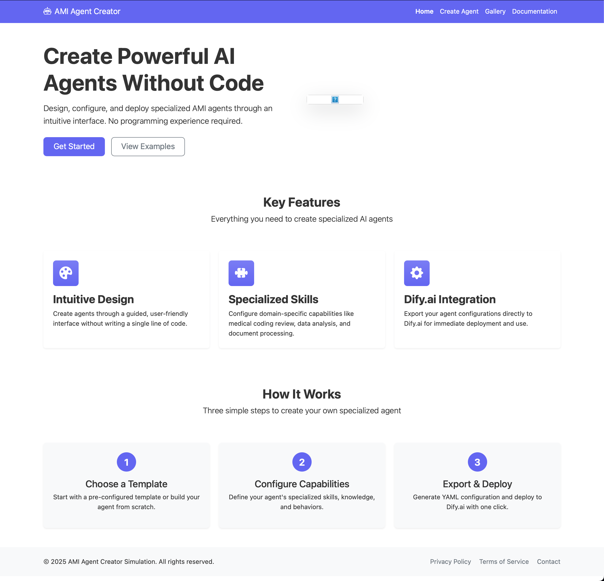

# Ailevate AMI Agent Creator Simulation

## Overview

The Ailevate AMI Agent Creator Simulation is an interactive web-based application designed to demonstrate the process of configuring and deploying specialized AI agents using the Adaptive Machine Intelligence (AMI) framework. This simulation allows users to explore the creation of AI agents with customized capabilities, knowledge bases, and adaptive learning configurations.



## Purpose

This simulation serves as a demonstration tool for the following purposes:

- Showcase the potential of configurable AI agents for specialized tasks
- Demonstrate the OODA (Observe, Orient, Decide, Act) loop implementation for adaptive AI
- Illustrate the process of AI agent configuration from template selection to deployment
- Provide a visual representation of how AI agents can be customized for different domains

## Technical Stack

- **Frontend**: HTML5, CSS3, JavaScript (Vanilla)
- **UI Framework**: Bootstrap 5
- **Icons**: Bootstrap Icons
- **No backend** (static HTML simulation)

## Features

### 1. Multi-step Wizard Interface

The simulation offers a guided six-step process for creating an AI agent:

1. **Choose Template**: Select from specialized agent templates or start from scratch
2. **Basic Info**: Define the agent's identity and purpose
3. **Capabilities**: Configure the specialized skills and knowledge
4. **Settings**: Set model parameters and advanced features
5. **Goals & Evaluation**: Configure the OODA loop and define success metrics
6. **Preview & Export**: Simulate the agent's behavior and export configuration

### 2. Template Selection

Users can select from pre-configured templates:

- **Medical Coding Review**: Specialized for healthcare coding validation
- **Data Analysis**: Focused on data processing and insights
- **Customer Support**: Designed for customer service interactions
- **Blank Template**: For custom configurations

Each template pre-populates relevant capabilities, knowledge bases, and settings to demonstrate domain-specific customization.

### 3. Specialized Capabilities

The simulation demonstrates domain-specific capabilities based on the selected template:

#### Medical Coding Template
- Medical Coding Analysis
- ICD-10 and CPT code knowledge
- Compliance Checking
- Medical documentation summarization

#### Data Analysis Template
- Data Analysis tools
- Statistical Methods knowledge
- Data Visualization capabilities
- Predictive Analysis

#### Customer Support Template
- Question Answering
- Product Information knowledge
- Ticket Management capabilities
- Sentiment Analysis

### 4. OODA Loop Implementation

A key feature is the demonstration of the OODA (Observe, Orient, Decide, Act) loop for adaptive AI:

- **Observe**: Collecting relevant data from user interactions and task outcomes
- **Orient**: Analyzing data against goals and adjusting internal models
- **Decide**: Selecting optimal strategies to achieve defined goals
- **Act**: Executing selected strategies and measuring effectiveness

The simulation includes a visualization of this cycle with performance metrics and adaptation parameters.

### 5. Interactive Simulations

Two simulation modes demonstrate the agent's capabilities:

- **Basic Simulation**: Shows a simple conversation flow between user and agent
- **OODA Loop Simulation**: Demonstrates the adaptive learning process over multiple cycles

### 6. YAML Configuration Export

The simulation can generate a mock YAML configuration that could theoretically be used to deploy the agent in a production environment.

## Project Structure

```
AMI-Agent-Creator-Sim/
├── assets/
│   ├── css/
│   │   └── style.css        # Main stylesheet
│   ├── images/              # Project images and logos
│   └── js/
│       └── main.js          # Additional JavaScript (if separated)
├── templates/
│   ├── create.html          # Main agent creation wizard
│   ├── docs.html            # Documentation page
│   └── gallery.html         # Agent gallery showcase
└── index.html               # Landing page
```

## User Flow

1. User visits the landing page and clicks "Create Agent"
2. User selects a template matching their use case
3. User proceeds through the configuration wizard steps
4. At the capabilities step, the user sees domain-specific options
5. User configures model settings and OODA loop parameters
6. User runs simulations to preview agent behavior
7. User exports the configuration as YAML

## Implementation Details

### Template Selection

Template selection uses event listeners on card elements, with visual feedback for selection state:

```javascript
allCards.forEach(card => {
    card.addEventListener('click', function() {
        // Get template ID from the data attribute
        const templateId = this.getAttribute('data-template-id');
        
        // Remove selected state from all cards
        allCards.forEach(c => {
            c.classList.remove('selected-card');
        });
        
        // Mark this card as selected
        this.classList.add('selected-card');
        
        // Store the selected template ID
        selectedTemplateInput.value = templateId;
        window.selectedTemplateType = templateId;
        
        // Enable continue button
        continueBtn.disabled = false;
        continueBtn.classList.remove('btn-secondary');
        continueBtn.classList.add('btn-primary');
    });
});
```

### Dynamic Capabilities

The capabilities section dynamically updates based on the selected template:

```javascript
function updateCapabilitiesSection() {
    const templateId = window.selectedTemplateType;
    
    // Update the heading to reflect the template
    const capabilitiesHeading = capabilitiesSection.querySelector('h3');
    
    if (capabilitiesHeading) {
        switch(templateId) {
            case 'medical-coding':
                capabilitiesHeading.textContent = "Medical Coding Capabilities";
                break;
            case 'data-analysis':
                capabilitiesHeading.textContent = "Data Analysis Capabilities";
                break;
            // Additional cases...
        }
    }
    
    // Customize capabilities for the template
    highlightTemplateCapabilities(templateId);
}
```

### OODA Loop Simulation

The OODA Loop simulation demonstrates adaptive AI learning:

```javascript
function simulateOODALoop() {
    // Initialize metrics
    updateOODAMetrics('65%', '0%', 'S1', '1');
    
    // CYCLE 1
    addSystemMessage("OBSERVE: Collecting initial performance data...");
    // Show user interaction
    addMessageToPreview('user', userQuestion1);
    addMessageToPreview('agent', agentResponse1);
    
    // CYCLE 2
    addSystemMessage("ORIENT: Analyzing performance data against goal...");
    updateOODAMetrics('72%', '25%', 'S2', '2');
    
    // CYCLE 3
    addSystemMessage("DECIDE: Strategy S2 shows improvement...");
    updateOODAMetrics('85%', '60%', 'S3', '3');
    
    // Final state
    addSystemMessage("ACT: Optimization complete. Goal progress at 85%.");
}
```

## Limitations and Future Enhancements

As this is a simulation in the "crawl" phase of development, there are several limitations:

1. **Static Implementation**: No backend or actual AI integration
2. **Limited Interaction**: Simulated conversations only
3. **Predefined Scenarios**: No true dynamic content generation
4. **No Persistence**: Configurations aren't saved between sessions

Future "walk" and "run" phases could include:

1. **Backend Integration**: Connect to actual AI models
2. **Real-time Interaction**: Allow users to converse with created agents
3. **Persistent Storage**: Save agent configurations for later use
4. **Advanced Analytics**: Track agent performance over time
5. **Feedback Loops**: Implement actual learning from user feedback
6. **Multi-Agent Interaction**: Demonstrate agent collaboration

## Usage

To run the simulation:

1. Clone the repository
2. Open `index.html` in a modern web browser
3. Navigate through the simulation interface
4. Experiment with different templates and configurations

## Conclusion

The Ailevate AMI Agent Creator Simulation provides a visual and interactive demonstration of AI agent configuration with specialized capabilities. While currently a static simulation, it effectively illustrates the potential of configurable AI agents and the OODA loop methodology for adaptive intelligence.

As AI technology continues to evolve, this simulation framework can serve as a foundation for more advanced implementations that incorporate actual AI models, learning mechanisms, and deployment options.